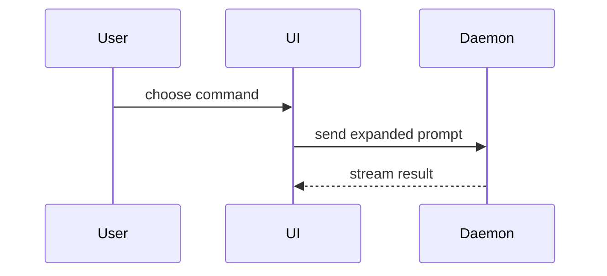

用视觉方式帮助用户理解当前对话主题。跳过前言，保持文字简短。选择能讲清关键点的最小视图。

- 用伪代码展示逻辑或算法：

```text
on(save)
  if content is unchanged
    return cached result
  write new content
  return fresh result
```

- 用调用树展示运行时控制流：

```text
submitForm
  createSession
    persistPrompt
    launchAgent
  navigateToSession
```

- 用组件树展示 UI 结构，包括重要的状态和模块边界：

```tsx
<SessionPage> (apps/example/src/routes/session.tsx)
  useSessionEvents()
  <SessionToolbar>
    <RunSkillButton> (packages/ui)
```

- 用浅层文件树展示文件职责或大范围重构：

```text
src/
├── commands/       # parses user actions
├── sessions/       # owns session state
└── transport/      # sends API requests
```

- 用 Mermaid 展示组件交互、控制流或数据流：



- 当重点是发生了什么变化且周围结构已经存在时，使用 `diff`。让 diff 的形状匹配主题。

对于组件变更：

```diff
 <SessionPage>
   useSessionEvents()
   <SessionToolbar>
+    <RunSkillButton />
   <SessionTimeline>
+    <SkillResultCard />
```

对于文件布局变更：

```diff
 src/
 ├── commands/
+│   └── show-me.ts       # expands the slash command
 ├── sessions/
-└── transport.ts
+└── transport/
+    ├── client.ts
+    └── stream.ts
```

对于调用树或调用栈变更：

```diff
 submitForm
   createSession
     persistPrompt
+    expandSkillMention
     launchAgent
-  navigateToSession
+  navigateToSession
+    subscribeToEvents
```

对于状态或控制流变更：

```diff
 on(save)
-  write content
+  if content is unchanged
+    return cached result
+  write content
+  invalidate cache
```

- 当大部分内容都是新增的、隐藏上下文会掩盖归属或顺序，或用户需要可复制的目标形状时，展示完整代码块：

```ts
function expandSkill(command: string): string {
  const skillName = command.slice(1)
  return `use the ${skillName} skill`
}
```

- 对于视觉 UI、布局、状态对比，或 Mermaid 难以表达的概念，编写一个聚焦的 HTML 文件——可以是图表、信息图或简短的幻灯片，选择最适合表达重点的形式。匹配产品的颜色、字体、间距和组件；使用真实的标签和数据；支持桌面端和移动端。然后为用户打开它：

```
Bash(open path/to/show-me-{description}.html)
```

### 指导

将每个视觉内容放在它所支持的简短文字旁边。只保留回答用户当前问题或解决当前讨论点的选项所需的调用、文件、props、状态和边界。

你可以使用其中一种，也可以使用几种，但不太可能全部使用。自行判断，不要让用户应接不暇。
